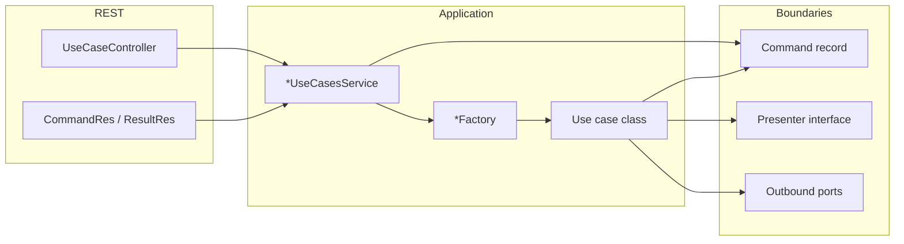

# Guidelines: Implementing a Use Case

This document describes how use cases are structured: REST surface, application orchestration, factories, domain commands, presenters, and outbound ports.

## Architecture at a glance

The flow is:

**HTTP** → **Controller** (`*UseCaseController`) → **Use cases service** (`*UseCasesService`) → **Factory** (`*Factory`) → **Use case** (implements `UseCase`) → **Outbound ports** (interfaces) → **Adapters** (`*OutboundPortImpl`) → **Core / infrastructure** (CRUD services, clients, etc.).

- The **use case** stays free of Spring and HTTP: it receives a **command** (domain input) and talks to the outside world only through **ports**.
- The **presenter** is the use case’s output boundary: it receives domain results (e.g. `presentX(...)`).
- The **factory** is the composition root for a single use case: it wires concrete port implementations and returns a `UseCase` instance.
- The **use cases service** adapts REST DTOs to commands, runs the use case, and maps domain results back to API resources.

### Hard boundaries (use case package)

- **REST resources (`*CommandRes`, `*ResultRes`, and any `*Res` under `rest.v<*>.resources`) MUST NOT** be referenced inside the use case package (`...services.usecases.*`). They belong to the HTTP adapter; only the **use cases service** (and controller) may use them.
- **Commands** passed into the use case MUST carry **domain data only**: JPA **entities**, value types, or **small immutable records** you declare for denormalized input—never API DTOs.
- **Presenters** MUST accept **domain results** (entities, domain records, or primitives)—not `*Res` types.
- **Outbound port implementations** (`*OutboundPortImpl`) MUST be **plain Java classes** (no `@Component`, `@Service`, or other Spring stereotypes). The **factory** is the only `@Component` in that slice: it constructs port impls with `new` and passes **Spring-injected collaborators** (core services, mappers, clients, `TransactionalOutboundPort`) into their constructors. Port interfaces stay free of framework types.

---

## 1. Shared building blocks (`utils.usecases`)

| Artifact                    | Role                                                                                                                                                                                                                  |
| --------------------------- | --------------------------------------------------------------------------------------------------------------------------------------------------------------------------------------------------------------------- |
| `UseCase`                   | Single method: `void execute()`. Every use case class implements this interface.                                                                                                                                      |
| `TransactionalOutboundPort` | Wraps work in a transaction (`doInTransaction`, `doInTransactionWithResults`). Injected into factories; implemented by `DefaultTransactionalOutboundPortImpl` (Spring `TransactionTemplate`, serializable isolation). |

Use the transactional port inside the use case when the operation must be atomic (typical for persistence + side effects that belong in the same transaction).

---

## 2. REST API: controller and resources

### Controller

- **Package:** `...controllers`
- **Class name:** `*UseCaseController` (e.g. `DataProductUseCaseController`).
- **Annotations:** `@RestController`, `@RequestMapping`, `produces = MediaType.APPLICATION_JSON_VALUE`.
- **Responsibility:** Map HTTP to the corresponding `*UseCasesService` method only. No business rules.
- **OpenAPI:** `@Tag`, `@Operation`, `@ApiResponses`, `@Parameter`; use `@Schema(implementation = ...)` on responses where applicable. Use `@Hidden` for endpoints that should not appear in public API docs.

### Resources (DTOs)

- **Package:** `rest.v2.resources.<aggregate>.usecases.<verb>` (e.g. `...dataproduct.usecases.init`).
- **Naming:**
  - Request body: `*CommandRes` (e.g. `DataProductInitCommandRes`).
  - Response body: `*ResultRes` when returning payload (e.g. `DataProductInitResultRes`).
- **Content:** JavaBeans with getters/setters (and empty constructor for Jackson), fields documented with `@Schema` where useful.
- **Mapping:** Use existing mappers under `rest.v2.resources` (e.g. `DataProductMapper`, `DataProductRepoMapper`) to convert between `*Res` and **domain entities** inside the use cases service—not inside the controller.

---

## 3. Use cases service (`*UseCasesService`)

- **Package:** `...<aggregate>.services` (e.g. `dataproduct.services`).
- **Annotation:** `@Service`.
- **Responsibility:**
  1. Convert `*CommandRes` → domain **command** (record) using mappers (`toEntity`, etc.). This is the **only** layer that bridges `*Res` ↔ entities for the use case.
  2. Build a **presenter** implementation:
    - Often a **private static inner class** `*ResultHolder` that implements the presenter interface and stores the last `present*` argument for later `getResult()`.
    - For void outcomes, a **lambda** implementing the presenter is acceptable when there is nothing to return (e.g. delete).
  3. Call `factory.build...(command, presenter).execute()`.
  4. Map domain result to `*ResultRes` when needed.

Keep this class as the single place that knows both REST mappers and use-case boundaries for that aggregate’s use cases.

---

## 4. Use case package layout

For one behavioral slice (e.g. “initialize data product”), colocate under `...services.usecases.<name>`:

| File                     | Purpose                                                                              |
| ------------------------ | ------------------------------------------------------------------------------------ |
| `<Name>.java`            | Use case class: `class <Name> implements UseCase`, **package-private**.              |
| `<Name>Command.java`     | Input: **Java `record`** (or equivalent) holding **entities** and/or **declared domain records**—never `*Res` types. |
| `<Name>Presenter.java`   | Output boundary: methods use **domain types** only (e.g. `presentRegistered(Blueprint entity)`), not REST DTOs. |
| `<Name>Factory.java`     | **`@Component`** (sole Spring bean here); method `UseCase build...(Command, Presenter)`. Instantiates port impls with `new`. |
| `*OutboundPort.java`     | Port interfaces (persistence, validation, notification, …). Domain-level method signatures. |
| `*OutboundPortImpl.java` | **Plain classes** (not Spring beans): implement ports; receive collaborators via constructor only. |

Optional: split ports by concern (`...PersistenceOutboundPort`, `...NotificationOutboundPort`, `...ValidationOutboundPort`, etc.).

---

## 5. Use case class

- Implements `UseCase` and implements `execute()`.
- **Constructor** receives: command, presenter, outbound ports, and `TransactionalOutboundPort` when transactions are required.
- **Visibility:** package-private (`class Foo implements UseCase`) so only the factory in the same package constructs it.
- **Logic:** Validate command; orchestrate ports; call presenter methods when the business outcome is ready. Throw domain/API exceptions (`BadRequestException`, etc.) for invalid state. Must contain ONLY business logic.
- **No** `@Autowired` on the use case class itself.
- **No** spring annotations on the use case class itself.

---

## 6. Command and presenter

- **Command:** Immutable **record** with **domain types only** (entities, UUIDs, enums, or small records you define in the use case package for structured input). **Never** use `*Res` / REST resources in the command.
- **Presenter:** Interface named `<Action>Presenter` with one or more `present...` methods using **domain types** for arguments. The use case calls these to push results outward; the use cases service maps domain results to `*ResultRes` for HTTP.

---

## 7. Factories (`*Factory`)

- `**@Component`** in the same package as the use case (typically the **only** `@Component` in that package).
- **Inject** Spring beans needed to **construct** port implementations: core services (`*Service`, `*CrudService`), `TransactionalOutboundPort`, clients, **MapStruct mappers** between entities and `*Res` when ports need them, etc.
- **Method signature:** `public UseCase build<Name>(<Name>Command command, <Name>Presenter presenter)`.
- **Inside:** `new <Name>OutboundPortImpl(...)` for each port—**never** register port impls as Spring beans. Pass `new <Name>(command, presenter, ...ports, transactionalOutboundPort)`.

The factory is the only place that chooses concrete port implementations for that use case.

---

## 8. Outbound ports and adapters

- **Interface:** `<UseCase><Concern>OutboundPort` (e.g. `DataProductInitializerPersistenceOutboundPort`). Methods express what the use case needs in **domain terms** (`save(Blueprint)`, `validate(Blueprint)`, `emit...`)—not SQL, REST, or `*Res` types.
- **Implementation:** `<UseCase><Concern>OutboundPortImpl` is a **plain Java class** (no `@Component` / `@Service`). It receives **constructor-injected** collaborators supplied by the factory (core `*Service`, mappers, clients). It may call:
  - **Core layer** services (e.g. `DataProductsService`, `DescriptorVariableCrudService`), or
  - **Clients** (e.g. `NotificationClient`), with entity ↔ `*Res` mapping **inside the impl** when the core API still uses resources.
- **Visibility:** Port interfaces and their impls are often **package-private** so the boundary stays inside the use case package.
- **Transactional port:** Shared across use cases; do not reimplement transaction handling inside each use case—delegate to `TransactionalOutboundPort`.
- **No Spring on port impls:** If a concern needs to be testable in isolation, use plain `new` in unit tests or test the factory with mocked collaborators—not `@MockBean` on the impl type as a bean.

---

## 9. Core services vs use case layer

- `**...services.core.*`** (and similar): CRUD, queries, reusable domain operations. Use cases **do not** call these directly from the use case class; they go through outbound ports whose impls delegate to core services.
- `**utils.usecases`:** Cross-cutting use-case infrastructure (`UseCase`, `TransactionalOutboundPort`).

---

## 10. Testing

- Add or extend **integration tests** for use case controllers (e.g. `*UseCaseControllerIT` under `src/test/java/...rest.v2.controllers`) to verify the full stack for the new endpoint.
- Unit-test complex port adapters or use case logic where it pays off (existing project uses tests such as `*OutboundPortTest` in some areas).

---

## 11. Checklist for a new use case

1. Define **command** record (domain only) and **presenter** interface (domain arguments only) in `...services.usecases.<name>`.
2. Define **outbound port** interfaces and **plain `*OutboundPortImpl` classes** (no Spring annotations). Implement validation/persistence/etc. with collaborators passed from the factory.
3. Add **`@Component` factory** only: construct port impls with `new`, inject `TransactionalOutboundPort` and core services/mappers.
4. Add `***UseCasesService`** methods (or extend an existing one): map `*CommandRes` → entity/command, run factory + `execute()`, map domain result from presenter to `*ResultRes`.
5. Add `**CommandRes` / `ResultRes**` under `rest.v2.resources...usecases...` with OpenAPI `@Schema` as needed.
6. Add `**@RestController**` endpoint calling the use cases service; document with OpenAPI.
7. Add **integration test** for the new route.

Following these steps keeps new behavior consistent with the existing hexagonal-style layout: **ports/adapters** for infrastructure, **use case** for orchestration, **REST** as a thin adapter on top of the use cases service.