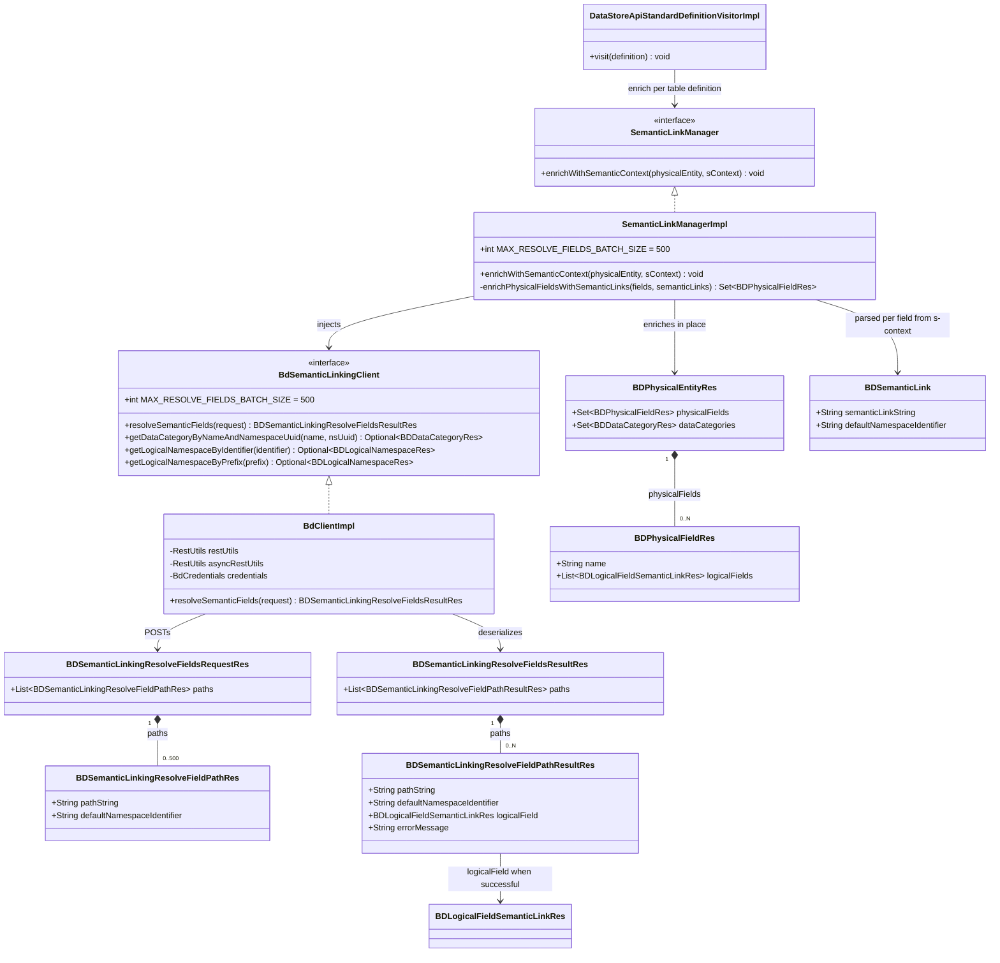

# Observer Bulk Semantic Field Resolve (BDMD-5296)

## Requirements

Change the observer so that semantic-path resolution for one physical entity is done with Blindata’s bulk `POST */resolvefields` (cap 500) instead of one GET `*/resolvefield` per field, without changing path composition, per-entity batching, or validator/upload sharing of `SemanticLinkManager`.

- Reduce Blindata HTTP round-trips when a table has tens or hundreds of semantically linked fields.
- Keep enrichment scoped to the physical entity currently being visited (same as `enrichWithSemanticContext` today). Do not coalesce tables, ports, or product versions into one call.
- Chunk, do not truncate: if one entity has more than 500 unique (path, namespace) pairs, issue further bulk calls until every linked field on that entity is attempted.
- Honor `blindata.enableAsync` the same way as quality import-objects / port-assets: wrap the synchronous bulk POST with existing async request/poll. Do not invent a dedicated job API.
- Per-path glossary failures stay non-blocking (`[#90]`); transport 5xx still aborts enrichment.
- This prompt covers **the observer only**. The Blindata bulk API already exists (`POST /api/v1/logical/semanticlinking/*/resolvefields`). Do not change `blindata-api` here.

## Scenarios

Each scenario below **must** have a corresponding test. Immediately above each `@Test` method signature, place comments that restate the **full** Gherkin text of that scenario (Feature line optional; include Scenario / Given / And / When / Then / And as written here). Use `//` line comments (not `/* */`) so path tokens such as `*/resolvefield` remain valid Java. Do not paraphrase in the comment. One scenario = one test method. Do not add tests that are not listed here.

Existing `SemanticLinkManagerTest` methods that trace `agentspecs/specs/semantic_linking/prefixed_concept_resolution/spec.md` stay; update their client mocks to bulk resolve (see Operations). Do **not** convert those agentspec tests into the Gherkin comments below, and do **not** duplicate them as extra scenarios.

```gherkin
Feature: Observer bulk semantic field resolve

  Scenario: Multiple linked fields on one entity are resolved in one bulk call
    Given a physical entity with two fields linked to [Stock].stockQuantity and [Stock].reservedQuantity
    And a resolvable default namespace and data category
    When enrichWithSemanticContext runs
    Then resolveSemanticFields is invoked exactly once
    And the bulk request contains both paths with the entity default namespace
    And both physical fields receive the corresponding resolved logical field

  Scenario: Duplicate path and namespace on two fields is resolved once
    Given a physical entity with two fields that share the same semantic path and default namespace
    And a resolvable default namespace and data category
    When enrichWithSemanticContext runs
    Then the bulk request contains exactly one path for that path and namespace
    And both physical fields receive the same resolved logical field

  Scenario: More than 500 unique linked fields are chunked and none are dropped
    Given a physical entity with 501 fields each with a unique resolvable semantic path
    And a resolvable default namespace and data category
    When enrichWithSemanticContext runs
    Then resolveSemanticFields is invoked twice
    And the first call has 500 paths
    And the second call has 1 path
    And no call has more than 500 paths
    And all 501 fields receive a resolved logical field

  Scenario: Fields without semantic links are omitted from the bulk request
    Given a physical entity with one linked field and one field with no semantic path
    And a resolvable default namespace and data category
    When enrichWithSemanticContext runs
    Then the bulk request contains only the linked field path
    And the unlinked field remains without logical fields

  Scenario: Entity with no linked fields does not call Blindata resolve
    Given a physical entity whose fields have no semantic paths
    And a resolvable default namespace and data category
    When enrichWithSemanticContext runs
    Then resolveSemanticFields is never invoked

  Scenario: One unresolvable path does not block sibling fields
    Given a physical entity with a valid path and an unknown path
    And a resolvable default namespace and data category
    And the bulk result marks the unknown path as failed with an error message
    When enrichWithSemanticContext runs
    Then the valid field receives its resolved logical field
    And the unknown field is left unmodified
    And a [#90] warning is logged for the unknown path

  Scenario: All paths unresolvable still completes enrichment
    Given a physical entity with two linked fields
    And a resolvable default namespace and data category
    And the bulk result marks every path as failed
    When enrichWithSemanticContext runs
    Then both fields are left unmodified
    And data categories are still set on the entity
    And a [#90] warning is logged for each path

  Scenario: Batching unit stays per physical entity
    Given two physical entities each with one linked field
    And a resolvable default namespace and data category
    When enrichWithSemanticContext runs for each entity
    Then resolveSemanticFields is invoked once per entity
    And neither request contains the other entity's path

  Scenario: Validator dry-run uses bulk resolve
    Given a data product descriptor with semantic linking
    And namespace and data category lookups succeed
    And bulk resolve returns a failed path for the field path
    When the validator evaluate-policy endpoint is called
    Then resolveSemanticFields is invoked at least once
    And the evaluation fails with unable to resolve semantic elements for the field path

  Scenario: Validator does not bulk-resolve when data category is missing
    Given a data product descriptor with semantic linking
    And the data category lookup returns empty
    When the validator evaluate-policy endpoint is called
    Then resolveSemanticFields is never invoked

  Scenario: Transport 5xx on bulk resolve aborts remaining enrichment
    Given a physical entity with linked fields
    And a resolvable default namespace and data category
    And resolveSemanticFields throws BlindataClientException with status 500
    When enrichWithSemanticContext runs
    Then the exception is propagated
    And physical fields are not replaced with partial links

  Scenario: Transport 4xx on bulk resolve is logged and does not replace fields
    Given a physical entity with linked fields
    And a resolvable default namespace and data category
    And resolveSemanticFields throws BlindataClientException with status 400
    When enrichWithSemanticContext runs
    Then the exception is not propagated
    And a [#91] warning is logged
    And physical fields are not replaced with resolved links
```

## Entities



## Approach

1. **Client design**:
   - Replace `BdSemanticLinkingClient.getSemanticLinkElements(path, namespace)` with `resolveSemanticFields(BDSemanticLinkingResolveFieldsRequestRes request)`.
   - Observer enrichment **always** uses bulk (including a batch of one). Do not keep a parallel GET client path.
   - `BdClientImpl.resolveSemanticFields` POSTs to `{blindataUrl}/api/v1/logical/semanticlinking/*/resolvefields?batchSize=500`.
   - Select `asyncRestUtils` vs `restUtils` with `credentials.getEnableAsync()`, identical to `uploadQuality` / `createDataProductAssets` / `createPolicyEvaluationRecords` / `patchDataProduct`. No new poll loop.
   - Request/response Java types mirror the API wrapper resources (class wrapping `paths`, never a raw list) so the contract can grow. Jackson in `BaseRestUtils` already uses `FAIL_ON_UNKNOWN_PROPERTIES=false`.
   - Delete unused `BDSemanticLinkingResolveFieldOptions` once GET is removed.

2. **Manager design**:
   - Keep `parseSemanticContext`, namespace lookup, data-category lookup, `s-type` / prefix handling, and `withErrorHandling` unchanged.
   - Replace the per-field loop in `enrichPhysicalFieldsWithSemanticLinks` with: collect fields that have a `BDSemanticLink` → unique (pathString, defaultNamespaceIdentifier) in encounter order → `Lists.partition(..., 500)` → one `resolveSemanticFields` per chunk → map outcomes back onto **every** physical field that used that pair.
   - Do not call Blindata when the unique-path list is empty.
   - Successful path (`logicalField != null` and `errorMessage == null`): attach `List.of(logicalField)` as today.
   - Failed or missing path: log `[#90] Unable to resolve semantic elements for semantic link path: {path}` (same text as today so validator still matches) and leave the field unmodified.
   - Do not catch glossary errors in the manager; the API already isolates them per path. HTTP/transport failures still surface as `BlindataClientException` and go through existing `withErrorHandling` (5xx rethrow, other statuses `[#91]`).

3. **Business logic**:
   - Batching unit = one `enrichWithSemanticContext` invocation = one physical entity.
   - Max paths per HTTP call = 500 (code constant, not `application.yml`).
   - Dedupe only within the current entity; two columns with the same path share one resolution.
   - Path strings passed to Blindata remain the composed strings already produced by `handleSimpleSemanticPath` (including `[Stock].…` prefixing and `lux:` segments).
   - Validator dry-run and live upload keep sharing `SemanticLinkManagerImpl`; there is no second implementation.

## Structure

### Inheritance Relationships

1. `SemanticLinkManagerImpl` implements `SemanticLinkManager` (unchanged public method).
2. `BdClientImpl` implements `BdSemanticLinkingClient` (method set changes as above).
3. New request/result resources are plain Java DTOs in `…resources.blindata.logical`, same style as `BDLogicalFieldSemanticLinkRes` / `BDQualityUploadRes` (getters/setters, no `@ResourceVersion` — that annotation is API-only).

### Dependencies

1. `SemanticLinkingManagerFactory` still injects `BdSemanticLinkingClient`; no factory change unless the constructor changes (it should not).
2. `DataStoreApiStandardDefinitionVisitorImpl.visit` still calls `enrichWithSemanticContext` once per table definition.
3. Validator and upload continue to use the same `SemanticLinkManager` bean.

### Layered Architecture

1. Visitor / datastore walk: unchanged per-entity visit.
2. Semantic link manager: parse + concept lookup + **batch** field resolve + attach.
3. Blindata client: thin POST (+ optional async wrap).
4. Rest utils: existing `genericPost` / `AsyncRestUtilsTemplate`.
5. Exception handling: existing `withErrorHandling` + `BlindataClientException`.

## Operations

### Create Resource - BDSemanticLinkingResolveFieldPathRes

1. Responsibility: One path to resolve (matches API `SemanticLinkingResolveFieldPathRes` JSON).
2. Attributes:
   - `pathString`: String
   - `defaultNamespaceIdentifier`: String
3. Methods: getters/setters.
4. Package: `org.opendatamesh.platform.up.metaservice.blindata.resources.blindata.logical`.

### Create Resource - BDSemanticLinkingResolveFieldsRequestRes

1. Responsibility: Extensible bulk request body (`paths` list). Never a raw Java `List` as the POST body type.
2. Attributes:
   - `paths`: `List<BDSemanticLinkingResolveFieldPathRes>`
3. Methods: getters/setters.

### Create Resource - BDSemanticLinkingResolveFieldPathResultRes

1. Responsibility: Per-path outcome (matches API `SemanticLinkingResolveFieldPathResultRes`).
2. Attributes:
   - `pathString`: String — echo
   - `defaultNamespaceIdentifier`: String — echo
   - `logicalField`: `BDLogicalFieldSemanticLinkRes` — success only
   - `errorMessage`: String — failure only
3. Methods: getters/setters. Optional `isSuccessful()` = `errorMessage == null && logicalField != null` for manager mapping.

### Create Resource - BDSemanticLinkingResolveFieldsResultRes

1. Responsibility: Extensible bulk response wrapper. Do not add required counters in this change.
2. Attributes:
   - `paths`: `List<BDSemanticLinkingResolveFieldPathResultRes>`
3. Methods: getters/setters. Treat null `paths` as empty when mapping.

### Update Interface - BdSemanticLinkingClient

1. Remove `getSemanticLinkElements(String pathString, String defaultNamespaceIdentifier)`.
2. Add:

```
int MAX_RESOLVE_FIELDS_BATCH_SIZE = 500;

BDSemanticLinkingResolveFieldsResultRes resolveSemanticFields(
    BDSemanticLinkingResolveFieldsRequestRes request
);
```

3. Keep namespace and data-category methods unchanged.

### Update Client - BdClientImpl.resolveSemanticFields

1. Responsibility: POST the wrapper to Blindata; optionally async-wrap.
2. Logic:
   - `RestUtils rest = credentials.getEnableAsync() ? asyncRestUtils : restUtils;`
   - URL: `credentials.getBlindataUrl() + "/api/v1/logical/semanticlinking/*/resolvefields?batchSize=" + BdSemanticLinkingClient.MAX_RESOLVE_FIELDS_BATCH_SIZE`
   - `return rest.genericPost(url, null, request, BDSemanticLinkingResolveFieldsResultRes.class);`
   - Catch `ClientException` → `BlindataClientException`; `ClientResourceMappingException` → `BlindataClientResourceMappingException` (same as `getSemanticLinkElements` / `uploadQuality`).
3. Do not chunk here. Do not add a dedicated async resolve API.
4. Remove `getSemanticLinkElements` and stop using `BDSemanticLinkingResolveFieldOptions`. Delete that options class if unused.

### Update Manager - SemanticLinkManagerImpl.enrichPhysicalFieldsWithSemanticLinks

1. Responsibility: Resolve all linked fields of **this** entity via bulk, then attach.
2. Logic:
   - If `fields` is null/empty, return as today.
   - Build a list of `{field, BDSemanticLink}` for fields whose name is present in `semanticLinks`.
   - Build unique paths: `LinkedHashMap` keyed by `pathString + '\0' + defaultNamespaceIdentifier` (or an equivalent pair key). First occurrence wins for the request path; all fields keep a reference to that key.
   - If unique paths is empty, return fields unchanged (no client call).
   - Partition unique paths with `Lists.partition(list, BdSemanticLinkingClient.MAX_RESOLVE_FIELDS_BATCH_SIZE)` (Guava already on the classpath).
   - For each partition: wrap in `BDSemanticLinkingResolveFieldsRequestRes`, call `client.resolveSemanticFields(request)`, accumulate path results into a map keyed by the same pair.
   - Map each original field:
     - No semantic link → return field unchanged.
     - Success in map → new `BDPhysicalFieldRes` copy with `logicalFields = List.of(resolved)` (same constructor as today).
     - Failure, missing result, or null `logicalField` → `getUseCaseLogger().warn("[#90] Unable to resolve semantic elements for semantic link path: " + path)` and return unmodified field.
   - Collect into a `Set` as today.
3. Do not change `enrichWithSemanticContext` control flow (namespace / data-category early returns stay).
4. Do not change `withErrorHandling`.
5. Do not look up namespaces or data categories inside the bulk loop.

### Update agentspec - prefixed_concept_resolution/spec.md

1. In **Feature: Blindata path passthrough**, change the When step from `getSemanticLinkElements` to `resolveSemanticFields`.
2. Then: the `pathString` on the bulk request path(s) MUST match the composed path expected by Blindata (same strings as today).
3. Do not rewrite other agentspec scenarios; existing `SemanticLinkManagerTest` methods keep tracing them.

### Update tests - SemanticLinkManagerTest (existing agentspec methods)

1. Replace every `when(…).getSemanticLinkElements` / `verify(…).getSemanticLinkElements` with `resolveSemanticFields`.
2. Helper (recommended): stub `resolveSemanticFields` with `thenAnswer` that, for each requested path, looks up a path→`BDLogicalFieldSemanticLinkRes` map and returns a successful path, or a failed path if absent.
3. Stock / film-rental / prefixed tests must still assert the **composed path strings** (now inside `request.getPaths()`), default namespace identifier, and attached logical fields.
4. Keep the existing javadoc comments that point at `agentspecs/specs/semantic_linking/prefixed_concept_resolution/spec.md`.

### Create tests - SemanticLinkManagerTest (Gherkin scenarios 1–8, 11–12)

1. Add one `@Test` per scenario listed under **Scenarios** except the two validator scenarios.
2. **Mandatory comment convention**: immediately before each new `@Test` method, `//` comments containing that scenario’s Gherkin copied verbatim (from `Scenario:` through its last `And`/`Then`).
3. Use a mock `UseCaseLogger` via `UseCaseLoggerContext` for `[#90]` / `[#91]` assertions (same pattern as `ProbesUploadTest` / `QualityUploadNameCodeConflictTest`). Restore the original logger in `finally`.
4. For 501 fields: build fields in a loop; do not create 501 glossary concepts. Stub bulk to succeed for every requested path. Use `ArgumentCaptor` (or `thenAnswer` counting invocations) to assert chunk sizes.
5. For 5xx / 4xx: `when(client.resolveSemanticFields(any())).thenThrow(new BlindataClientException(500|400, "…"))`. 5xx → `assertThrows`; 4xx → no throw + `[#91]`.
6. Method names should reflect the scenario (`testBulkResolve_multipleLinkedFields_singleCall`, etc.).

Example of the required comment placement:

```java
    // Scenario: Multiple linked fields on one entity are resolved in one bulk call
    // Given a physical entity with two fields linked to [Stock].stockQuantity and [Stock].reservedQuantity
    // And a resolvable default namespace and data category
    // When enrichWithSemanticContext runs
    // Then resolveSemanticFields is invoked exactly once
    // And the bulk request contains both paths with the entity default namespace
    // And both physical fields receive the corresponding resolved logical field
    @Test
    void testBulkResolve_multipleLinkedFields_singleCall() {
```

### Update tests - BlindataValidatorControllerIT (Gherkin scenarios 9–10)

1. Replace `getSemanticLinkElements` mocks/verifies with `resolveSemanticFields`.
2. **Missing semantic link element** test: stub bulk to return HTTP-success wrapper with a failed path (`errorMessage` set, `logicalField` null) for the descriptor path (today `[Customer]`). Keep asserting evaluation failure containing `Unable to resolve semantic elements for semantic link path:`.
3. **Missing data category** / **missing namespace** / **data product not found**: `verify(bdSemanticLinkingClient, never()).resolveSemanticFields(any())`.
4. Put the verbatim Gherkin `//` comments immediately above the two tests that correspond to the validator scenarios (adapt the existing methods rather than adding duplicates). Other validator tests in this class are not new Gherkin scenarios; only switch the client method name.
5. `BlindataValidatorProbesUploadDisabledIT` does not call resolve today; no change unless it fails to compile after the interface change.

## Norms

1. Annotation Standards: no new Spring stereotypes; manager stays package-private; resources stay unannotated POJOs like neighboring `BD*Res`.
2. Dependency Injection: keep `SemanticLinkingManagerFactory` field `@Autowired` + `@Qualifier("bdSemanticLinkingClient")`.
3. Exception Handling: no new types. Per-path glossary failures = payload `errorMessage` + `[#90]`. Transport = existing `withErrorHandling` (`[#91]` vs rethrow 500).
4. Data Validation: observer never sends more than 500 paths. `batchSize` query value is always 500. Do not add a yml property.
5. Logging: `[#90]` once per failed path (not once per duplicate field sharing that path, unless a field-level miss still needs a warn — prefer one warn per unique failed path). Do not INFO-log every path in a 500-path batch. Keep `[#85]`–`[#89]`, `[#120]`, `[#91]` as they are.
6. Documentation Standards: update the agentspec passthrough scenario only as specified. Do not add README.
7. Test documentation: every new (or validator-mapped) Gherkin test **must** have the verbatim Gherkin `//` comments immediately above the signature. Reviewers check Scenarios ↔ tests by matching those comments.

## Safeguards

1. Functional Constraints:
   - `enrichWithSemanticContext` public contract unchanged.
   - Path composition (relative vs `[Concept]…`, nested `s-type`, `prefix:Name`) unchanged; bulk paths use those same strings.
   - One entity with N unique linked paths and N ≤ 500 produces **one** Blindata resolve HTTP call (via the client method once).
   - One entity with 501 unique linked paths produces **two** calls (500 + 1); field 501 is resolved.
   - Two entities produce at least two resolve calls; paths are not merged across entities.
   - Duplicate (path, namespace) on one entity is sent once and applied to every matching field.
   - Empty / no linked fields: zero resolve calls.
   - Well-formed bulk with failed paths does not abort sibling fields; `[#90]` is logged; failed fields keep previous `logicalFields`.
   - Behavioral change vs today: a 4xx/null from **single-path GET** used to abort the remaining stream inside `withErrorHandling`. After this change, glossary misses inside a 200 wrapper no longer abort siblings. That is intended; the Gherkin partial-success scenario locks it in.
   - GET `*/resolvefield` on Blindata is not called by the observer anymore. The API GET itself is out of scope and must remain for other clients.
   - Exactly the 12 scenarios above are implemented as tests with verbatim Gherkin comments; existing agentspec tests remain in addition to those 12.

2. Performance Constraints:
   - Do not raise the cap above 500.
   - Do not parallelize GETs.
   - Do not add a new thread pool.
   - Namespace and data-category lookups stay per distinct concept, not per field.

3. Security Constraints:
   - Same Blindata auth headers / OAuth as other `BdClientImpl` calls.
   - Do not log API keys or full bulk payloads at INFO.

4. Integration Constraints:
   - Do not modify `blindata-api` in this change.
   - Do not persist catalog semantic links (observer still only attaches in-memory `logicalFields` before port-asset upload).
   - CSV `*/upload/physicalfields` remains unused.
   - `enableAsync` wrapping must reuse `asyncRestUtils`; do not call `/api/v1/settings/async/request` by hand.

5. Business Rule Constraints:
   - Batching unit is the current physical entity.
   - Default namespace is still `s-base` for all paths of that entity.
   - Validator and upload share one manager implementation.

6. Exception Handling Constraints:
   - Do not swallow 500s.
   - Do not change `withErrorHandling` semantics.
   - Do not catch `BlindataClientException` inside the per-field mapping loop.

7. Technical Constraints:
   - No application.yml batch-size property.
   - `MAX_RESOLVE_FIELDS_BATCH_SIZE = 500` is a code constant on `BdSemanticLinkingClient` (manager chunks with it; client puts it on the query string).
   - No Flyway / observer schema changes.
   - No dedicated async resolve job.

8. Data Constraints:
   - Bulk resolve does not create/update Blindata namespaces, data categories, logical fields, or physical assets.
   - Physical field names never appear in the bulk request.

9. API Constraints (observer as client):
   - Method: POST
   - Path: `/api/v1/logical/semanticlinking/*/resolvefields`
   - Query: `batchSize=500`
   - Body: `{ "paths": [ { "pathString", "defaultNamespaceIdentifier" } ] }`
   - Response 200: `{ "paths": [ { "pathString", "defaultNamespaceIdentifier", "logicalField?", "errorMessage?" } ] }`
   - Response 4xx/5xx: existing `BlindataClientException` mapping
