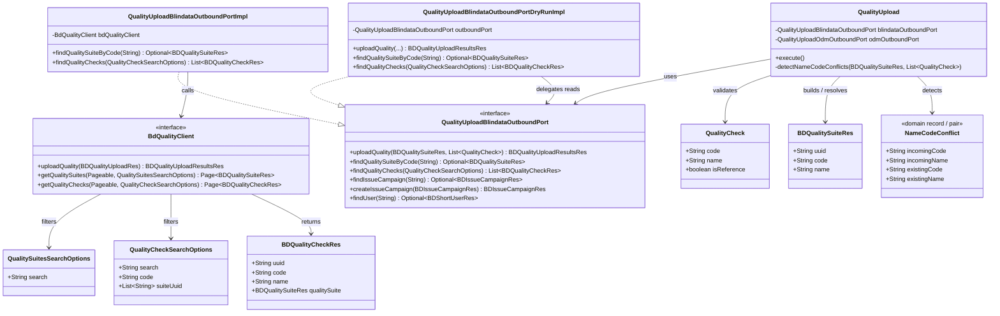

# Quality Check Name/Code Conflict Guard on Upload

## Requirements
Detect and warn when a descriptor-derived Quality Check would collide with an existing Blindata check in the same Quality Suite that shares the same display `name` but has a different `code`—typically after renaming `quality.name` without updating `customProperties.displayName` or using a stable `quality.id`—so the observer validator can fail policy evaluation with a clear, remediable message before Blindata’s opaque name-conflict create failure.

## Entities


## Approach
1. Pre-upload conflict guard (observer-side):
   - After suite codes are prefixed onto checks (`addQualitySuiteCodeToQualityChecksCode`), resolve the Blindata Quality Suite by suite `code`.
   - If the suite is absent, skip the guard (first upload cannot collide).
   - If present, load existing checks for that suite (prefer suite-scoped search once, not per-check round-trips).
   - For each incoming non-reference check, detect an existing Blindata check with exact equal `name` and different `code`.
   - Collect **all** conflicts; emit one `getUseCaseLogger().warn(...)` per conflict (validator-consumable), identifying both checks and suggesting update of `customProperties.displayName` **or** use of a stable `quality.id`.
   - Do **not** throw `UseCaseExecutionException` for this conflict; do **not** change Blindata upsert identity or descriptor code/name mapping.

2. Technical implementation:
   - Extend `BdQualityClient` + `BdClientImpl` with paginated read APIs mirroring Blindata `GET /api/v1/data-quality/suites` and `GET /api/v1/data-quality/checks`, reusing existing `QualitySuitesSearchOptions` / `QualityCheckSearchOptions`.
   - Expose suite/check lookup on `QualityUploadBlindataOutboundPort`; implement in `QualityUploadBlindataOutboundPortImpl`.
   - In `QualityUploadBlindataOutboundPortDryRunImpl`, **delegate** lookup methods to the wrapped live port (same pattern as `findIssueCampaign` / `findUser`); keep `uploadQuality` and `createIssueCampaign` no-op/stubbed.
   - Post-filter Blindata LIKE/`search` results with exact `name` equality to avoid false positives.
   - Prefer resolve suite once, then fetch checks filtered by `suiteUuid` (and optional search), then exact-match in memory.

3. Business logic:
   - Upsert identity remains `code` within suite; display `name` remains unique per suite on Blindata.
   - Conflict = same suite + same name + different code.
   - Matching code+name (update path) and new names (create path) must not warn.
   - References already stripped before guard; run guard only on final upload candidates.
   - Warning message must include incoming code/name, existing Blindata code/name, and dual remediation guidance.
   - Live upload continues after warn (residual Blindata conflict if validator bypassed is accepted); validator dry-run is the enforcement path.

## Structure

### Inheritance Relationships
1. `UseCase` interface defines `execute()` — implemented by package-private `QualityUpload`
2. `QualityUploadBlindataOutboundPort` interface defines Blindata side effects/reads for quality upload
3. `QualityUploadBlindataOutboundPortImpl` implements live Blindata adapter (plain Java, factory-constructed)
4. `QualityUploadBlindataOutboundPortDryRunImpl` implements dry-run decorator: stubs writes, delegates reads
5. `BdQualityClient` interface extended with suite/check page reads; `BdClientImpl` implements them

### Dependencies
1. `QualityUpload` calls `QualityUploadBlindataOutboundPort` for suite/check lookup and upload
2. `QualityUploadBlindataOutboundPortImpl` depends on `BdQualityClient`, `BdIssueCampaignClient`, `BdUserClient`, `QualityCheckMapper`, `BdIssueManagementConfig`
3. `QualityUploadFactory` (`@Component`) wires live and dry-run ports with `new`
4. `BlindataValidatorService` runs `qualityUploadFactory.getUseCaseDryRun(...).execute()` under `ValidatorUseCaseLogger`

### Layered Architecture
1. Event / Validator Layer: notification events and `BlindataValidatorService` dry-run orchestration
2. Use Case Layer: `QualityUpload` orchestration including name/code conflict guard
3. Outbound Port Layer: `QualityUploadBlindataOutboundPort` (+ dry-run decorator)
4. Client Layer: `BdQualityClient` / `BdClientImpl` HTTP to Blindata quality APIs
5. Exception / Logging Layer: `getUseCaseLogger().warn` → `ValidatorUseCaseLogger` → policy `evaluationResult=false` (no new GlobalExceptionHandler; observer is event-driven)

## Operations

### Extend Client - BdQualityClient / BdClientImpl
1. Responsibility: Enable read of Blindata quality suites and checks for pre-upload conflict detection
2. Methods:
   - `getQualitySuites(Pageable pageable, QualitySuitesSearchOptions filters): Page<BDQualitySuiteRes>`
     - Logic: `GET {blindataUrl}/api/v1/data-quality/suites` via `restUtils.getPage`, map ClientException → BlindataClientException (same pattern as campaigns/policies)
   - `getQualityChecks(Pageable pageable, QualityCheckSearchOptions filters): Page<BDQualityCheckRes>`
     - Logic: `GET {blindataUrl}/api/v1/data-quality/checks` via `restUtils.getPage`
3. Constraints: Reuse existing search option DTOs; no new Blindata DTO shapes unless fields are missing for uuid/code/name

### Update Outbound Port - QualityUploadBlindataOutboundPort (+ Impl + DryRun)
1. Responsibility: Expose suite resolve and suite-scoped check listing to the use case
2. Methods:
   - `findQualitySuiteByCode(String suiteCode): Optional<BDQualitySuiteRes>`
     - Logic: search suites (e.g. `search`/`filters` with suite code), then exact-match `code` equality; return first exact match or empty
   - `findQualityChecks(QualityCheckSearchOptions options): List<BDQualityCheckRes>` (or Page → list content)
     - Logic: call `BdQualityClient.getQualityChecks` with suiteUuid set; return content (paginate if needed until exhausted for the suite when conflict scanning)
3. Dry-run:
   - `findQualitySuiteByCode` / `findQualityChecks` **delegate** to wrapped live port
   - `uploadQuality` remains empty-result stub; `createIssueCampaign` remains stub
4. Annotations: none on port/impl (plain Java); factory remains sole `@Component` in slice

### Update Use Case - QualityUpload
1. Responsibility: After `addQualitySuiteCodeToQualityChecksCode`, run name/code conflict guard before `uploadQuality`
2. Methods:
   - `detectAndWarnNameCodeConflicts(BDQualitySuiteRes qualitySuite, List<QualityCheck> qualityChecks): void`
     - Logic:
       1. `Optional<BDQualitySuiteRes> existingSuite = blindataOutboundPort.findQualitySuiteByCode(qualitySuite.getCode())`
       2. If empty → return (no-op)
       3. Build `QualityCheckSearchOptions` with `suiteUuid = List.of(existingSuite.get().getUuid())`
       4. Load Blindata checks for suite (handle pagination)
       5. Index existing checks by exact `name` (or iterate); for each incoming check with text name+code:
          - Find existing where `Objects.equals(existing.getName(), incoming.getName())` AND `!Objects.equals(existing.getCode(), incoming.getCode())`
          - On match → `getUseCaseLogger().warn` with both parties + remediation (displayName **or** stable `quality.id`); assign next `[#NN]` warning tag consistent with existing series (after [#63])
       6. Collect/report **all** conflicts (no fail-fast)
     - Exception Handling: do not throw for conflict; BlindataClientException handling remains via existing `withErrorHandling`
3. Call site: invoke after suite code prefixing, before `blindataOutboundPort.uploadQuality(...)`
4. Constraints: do not alter mapping of code/name; do not auto-heal by rewriting codes

### Extend Unit Tests - QualityUploadTest
1. Responsibility: Cover guard unit behavior with mocked outbound port
2. Cases:
   - Suite absent → no warn, upload still invoked
   - Same name different code → warn once (or N times for N conflicts), upload still invoked
   - Same name same code → no warn
   - Multiple conflicts → all warned
3. Mock `findQualitySuiteByCode` / `findQualityChecks` as needed; existing upload tests must stub new methods (default empty) so they keep passing

### Create IT Tests with Gherkin - QualityUpload Name/Code Conflict (and/or Validator dry-run IT)
1. Responsibility: Validate acceptance criteria end-to-end against Spring IT harness (`ObserverBlindataAppIT` pattern), with Gherkin documented on each `@Test` (same style as `DataProductDeletionIT`)
2. Embed the following Feature in IT class Javadoc / method Javadoc and implement scenarios as tests (mock `BdQualityClient` reads + dry-run / validator path as appropriate):

```gherkin
Feature: Quality check name/code conflict detection on QUALITY_UPLOAD
  In order to avoid opaque Blindata create failures when renaming quality.name without aligning display identity
  As the Blindata observer
  I want to detect same-name / different-code collisions within a Quality Suite and emit clear warnings
  So that the observer validator fails policy evaluation with remediable messages before publish

  Background:
    Given a data product in domain "sales" with name "orders"
    And the Quality Suite code is "sales - orders"
    And QUALITY_UPLOAD extracts quality checks from descriptor ports
    And quality check codes are prefixed with the suite code before upload
    And Blindata upsert identity for quality checks is by code within the suite
    And Blindata enforces unique quality check name within the suite

  Scenario: AC1-AC3 — renamed technical name with unchanged displayName is detected and warned
    Given Blindata already has Quality Suite "sales - orders"
    And the suite contains a Quality Check with code "sales - orders - old_rule" and name "Customer Completeness"
    And the descriptor quality object has name "new_rule" without quality.id
    And customProperties.displayName is "Customer Completeness"
    When QUALITY_UPLOAD runs (live or dry-run)
    Then the observer resolves the suite on Blindata by code "sales - orders"
    And it detects a name/code conflict between incoming code "sales - orders - new_rule" / name "Customer Completeness"
      and existing code "sales - orders - old_rule" / name "Customer Completeness"
    And it emits a use-case warn identifying both checks
    And the warn suggests updating customProperties.displayName or using a stable quality.id
    And the warn is collected by ValidatorUseCaseLogger when running under the validator

  Scenario: AC2 — verify no Blindata check exists with same name and different code
    Given Blindata already has Quality Suite "sales - orders"
    And the suite contains Quality Check code "sales - orders - rule_a" name "Rule A"
    And the incoming check has code "sales - orders - rule_a" and name "Rule A"
    When QUALITY_UPLOAD runs the conflict guard
    Then no name/code conflict warning is emitted for that check

  Scenario: AC3 — collect all conflicts in one upload
    Given Blindata already has Quality Suite "sales - orders"
    And the suite contains checks:
      | code                         | name     |
      | sales - orders - old_one     | Name One |
      | sales - orders - old_two     | Name Two |
    And the descriptor produces incoming checks:
      | code                         | name     |
      | sales - orders - new_one     | Name One |
      | sales - orders - new_two     | Name Two |
    When QUALITY_UPLOAD runs the conflict guard
    Then two distinct use-case warnings are emitted
    And each warning identifies its conflicting pair
    And under the validator both warnings appear in rawError

  Scenario: AC4 — happy path upload/update by code continues without conflict warn
    Given Blindata already has Quality Suite "sales - orders"
    And the suite contains Quality Check code "sales - orders - stable" name "Stable Name"
    And the incoming check has code "sales - orders - stable" and name "Stable Name"
    When QUALITY_UPLOAD completes
    Then no name/code conflict warning is emitted
    And uploadQuality is invoked with the prefixed checks (live path)
    And dry-run stubs upload without error (validator path)

  Scenario: AC4b — intentional rename of both technical name and display name creates new check identity without this conflict
    Given Blindata already has Quality Suite "sales - orders"
    And the suite contains Quality Check code "sales - orders - old_rule" name "Old Display"
    And the descriptor quality object has name "new_rule"
    And customProperties.displayName is "New Display"
    When QUALITY_UPLOAD runs the conflict guard
    Then no name/code conflict warning is emitted for that check
    And Blindata would treat the incoming check as a different name (create-by-new-name path)

  Scenario: AC5 — first upload / suite absent is a no-op for the guard
    Given Blindata does not contain Quality Suite "sales - orders"
    And the descriptor defines one or more quality checks
    When QUALITY_UPLOAD runs the conflict guard
    Then findQualitySuiteByCode returns empty
    And no name/code conflict warning is emitted
    And upload proceeds as today (live) or dry-run stub upload (validator)

  Scenario: AC6 — observer validator dry-run surfaces conflict and fails policy evaluation
    Given the Blindata validator policy evaluation runs QUALITY_UPLOAD in dry-run
    And Blindata already has Quality Suite "sales - orders" with an existing same-name / different-code check
    And the descriptor produces a conflicting incoming check
    When BlindataValidatorService validates the data product
    Then QualityUploadBlindataOutboundPortDryRunImpl still performs suite/check read lookups against Blindata
    And uploadQuality is not persisted (dry-run stub)
    And ValidatorUseCaseLogger collects the conflict warning(s)
    And evaluationResult is false
    And rawError lists every collected warning message

  Scenario: Fuzzy Blindata search must not false-positive without exact name match
    Given Blindata suite-scoped search returns a check whose name only partially matches the incoming name
    When the conflict guard post-filters by exact name equality
    Then no conflict warning is emitted for that partial match
```

3. Implementation notes for ITs:
   - Prefer extending existing IT base (`ObserverBlindataAppIT`) and mocking `BdQualityClient` for suite/check pages
   - Trace each `@Test` to AC# via Feature/Scenario Javadoc comment
   - Assert warn delivery through validator result when testing AC6; assert port interactions for AC1–AC5 unit/IT hybrids
   - Do not require real Blindata; mock page responses with uuid/code/name

### Keep Mapping Unchanged
1. Responsibility: No changes to `DataStoreApiStandardDefinitionVisitorImpl` quality code/name/`displayName` mapping for this ticket
2. Constraints: Detection-only fix; do not derive Blindata name solely from `quality.name` or require `id` globally

## Norms
1. Annotation standards: Follow observer use-case slice rules from `spdd/norms/USE_CASE_IMPLEMENTATION.md` adapted to this repo — `@Component` only on `QualityUploadFactory`; no Spring stereotypes on `QualityUpload`, `*OutboundPortImpl`, or dry-run decorator. Client methods live on `BdQualityClient` / `BdClientImpl` without introducing a new controller (event/validator driven, not REST use-case controller).
2. Dependency injection: Constructor injection into factory; port impls constructed with `new` inside factory (`spdd/norms/README.md` cross-cutting DI; `spdd/norms/USE_CASE_IMPLEMENTATION.md` §7–8).
3. Exception handling:
   - Conflict path uses `getUseCaseLogger().warn` only — do not throw `UseCaseExecutionException` for name/code conflicts (`spdd/analysis` product decision; aligns with existing quality validation warns [#46]–[#63]).
   - Retain existing `withErrorHandling` for BlindataClientException / unexpected errors.
   - No new GlobalExceptionHandler required for this feature (observer is not exposing a new REST command surface).
4. Data validation: Exact name equality after Blindata search; suite-scoped comparison only; skip when suite missing; skip references (already removed).
5. Logging: Use `UseCaseLogger` / `getUseCaseLogger()` with `[QualityUpload]` prefix and a new `[#NN]` tag; never log secrets; ensure validator dry-run captures warns via `ValidatorUseCaseLogger` (`spdd/norms/README.md` Logging + Testing).
6. Documentation standards: Document IT scenarios with embedded Gherkin Feature/Scenario Javadoc (`DataProductDeletionIT` style); keep OpenAPI N/A for this change.
7. Use-case boundaries (`spdd/norms/USE_CASE_IMPLEMENTATION.md`): Orchestration stays in `QualityUpload`; Blindata HTTP stays behind outbound port + `BdQualityClient`; dry-run decorator must not stub conflict-detection reads.
8. CRUD template norms (`spdd/norms/GENERIC-CRUD-GUIDELINES.md`): **Not applicable** — no JPA Generic CRUD for this feature.

## Safeguards
1. Functional Constraints: Detection only; mapping of code/name/displayName unchanged; upsert remains by code; warn-not-throw for conflicts; collect all conflicts; suite-absent is no-op.
2. Performance Constraints: Resolve suite once per upload; load checks suite-scoped (paginate as needed) rather than one Blindata round-trip per incoming check when avoidable.
3. Security Constraints: Do not log credentials or Blindata auth headers; warning messages must not include sensitive tokens—only quality check codes/names and remediation text.
4. Integration Constraints: Reuse Blindata public list APIs (`/api/v1/data-quality/suites`, `/api/v1/data-quality/checks`) and existing search option DTOs; dry-run must still call read APIs.
5. Business Rule Constraints: Conflict iff same suite + exact same name + different code; remediations must mention both displayName update and stable `quality.id`.
6. Exception Handling Constraints: Conflicts are warns for validator consumption; do not introduce hard-fail `UseCaseExecutionException` for this scenario; do not rely solely on SLF4J (would bypass validator).
7. Technical Constraints: No Blindata-side upsert-by-name change; no silent auto-heal rewriting codes; exact name post-filter mandatory after LIKE/search.
8. Data Constraints: Guard runs on final non-reference checks after suite-code prefixing; empty/missing names should not invent collisions.
9. API Constraints: No new observer REST endpoints required; extend client/port contracts only as needed for reads.
10. Test Constraints: Unit tests cover guard branches; IT tests embed Gherkin for AC1–AC6 and verify validator `evaluationResult=false` when warnings present.
