# Quality Probes Upload to Blindata Probe Project

## Requirements
Enable the Blindata Observer, when optionally configured, to materialize executable Blindata quality probes (CONTRACT_RULE) inside a probe project aligned with the data product’s Quality Suite, so library/sql ODCS annotations can be scheduled and run by the Blindata Agent without manually recreating probe definitions—while KQI catalog upload remains separate, connection/scheduling stay operationally manual, and per-port connection name presence opts into probe upload (absence skips probes without blocking publish).

## Entities

```mermaid
classDiagram
direction TB

class ProbesUpload {
  -ProbesUploadBlindataOutboundPort blindataOutboundPort
  -ProbesUploadOdmOutboundPort odmOutboundPort
  +execute()
  -validateConnections() boolean
  -ensureProject() BDQualityProbesProjectRes
  -upsertProbes()
  -replaceVersionTag()
  -buildDefinition() BDQualityProbesDefinitionRes
  -buildProjectName() String
  -withErrorHandling()
}

class ProbesUploadOdmOutboundPort {
  <<interface>>
  +getDataProductVersion() DataProductVersion
  +extractProbeCandidates() List~ProbeCandidate~
}

class ProbesUploadOdmOutboundPortImpl {
  -DataProductPortAssetAnalyzer dataProductPortAssetAnalyzer
  -DataProductVersion dataProductVersion
  -BdProbesUploadConfig config
}

class ProbesUploadBlindataOutboundPort {
  <<interface>>
  +findProbeProjectByName(String) Optional~BDQualityProbesProjectRes~
  +createProbeProject(BDQualityProbesProjectRes) BDQualityProbesProjectRes
  +findProbeDefinitionByProjectAndName(String, String) Optional~BDQualityProbesDefinitionRes~
  +createProbeDefinition(BDQualityProbesDefinitionRes) BDQualityProbesDefinitionRes
  +overwriteProbeDefinition(String rootUuid, BDQualityProbesDefinitionRes) BDQualityProbesDefinitionRes
  +findProbeConnectionByName(String) Optional~BDQualityProbesConnectionRes~
  +findTagByProjectAndName(String projectUuid, String tagName) Optional~BDQualityProbesTagRes~
  +deleteTag(String tagUuid)
  +createTag(BDQualityProbesTagRes) BDQualityProbesTagRes
}

class ProbesUploadBlindataOutboundPortImpl {
  -BdProbesClient bdProbesClient
}

class ProbesUploadBlindataOutboundPortDryRunImpl {
  -ProbesUploadBlindataOutboundPort outboundPort
}

class ProbesUploadFactory {
  -BdProbesClient bdProbesClient
  -DataProductPortAssetAnalyzer dataProductPortAssetAnalyzer
  -BdProbesUploadConfig probesUploadConfig
  -ObjectMapper objectMapper
  +getUseCase(Event) UseCase
  +getUseCaseV2(EventV2) UseCase
  +getUseCaseDryRun(Event) UseCase
}

class BdProbesClient {
  <<interface>>
  +getProjects(Pageable, QualityProbesProjectSearchOptions) Page~BDQualityProbesProjectRes~
  +createProject(BDQualityProbesProjectRes) BDQualityProbesProjectRes
  +getDefinitions(Pageable, QualityProbesDefinitionSearchOptions) Page~BDQualityProbesDefinitionRes~
  +createDefinition(BDQualityProbesDefinitionRes) BDQualityProbesDefinitionRes
  +overwriteDefinition(String rootUuid, BDQualityProbesDefinitionRes) BDQualityProbesDefinitionRes
  +getConnections(Pageable, QualityProbesConnectionSearchOptions) Page~BDQualityProbesConnectionRes~
  +getTags(Pageable, QualityProbesTagSearchOptions) Page~BDQualityProbesTagRes~
  +deleteTag(String uuid)
  +createTag(BDQualityProbesTagRes) BDQualityProbesTagRes
}

class ContractRuleEnvelopeBuilder {
  <<utility>>
  +SCHEMA String
  +buildQueryBody(QualityCheck) Map
  +buildQueryBody(Map, PhysicalBinding) Map
  +buildRule(QualityCheck) Map
  +buildPhysicalBinding(QualityCheck) PhysicalBinding
}

class ProbeCandidate {
  +String probeName
  +String checkCode
  +String checkName
  +String connectionName
  +String connectionType
  +String portFullyQualifiedName
  +Map~String,Object~ contractRule
  +PhysicalBinding physicalBinding
}

class PhysicalBinding {
  +String schema
  +String object
  +String property
}

class BdProbesUploadConfig {
  +String connectionNamePropertyKey
}

class BDQualityProbesProjectRes {
  +String uuid
  +String name
  +String description
}

class BDQualityProbesDefinitionRes {
  +String rootUuid
  +String name
  +String type
  +String checkCode
  +String checkName
  +BDQualityProbesProjectRes project
  +List~BDQualityProbesQueryRes~ queries
}

class BDQualityProbesQueryRes {
  +String connectionName
  +String connectionType
  +Object queryBody
}

class BDQualityProbesTagRes {
  +String uuid
  +String name
  +String description
  +BDQualityProbesProjectRes project
}

class BDQualityProbesConnectionRes {
  +String uuid
  +String name
  +String type
}

class QualityCheck {
  +String code
  +String name
  +boolean isReference
  +BDQualityStrategyRes scoreStrategy
  +List~BDAdditionalPropertiesRes~ additionalProperties
  +List~BDPhysicalEntityRes~ physicalEntities
  +List~BDPhysicalFieldRes~ physicalFields
}

class DataProductPortAssetAnalyzer {
  +extractQualityChecksFromPorts(List~Port~) List~QualityCheck~
  +extractDeclaredQualityChecksFromPorts(List~Port~) List~QualityCheck~
}

ProbesUpload --> ProbesUploadBlindataOutboundPort : uses
ProbesUpload --> ProbesUploadOdmOutboundPort : uses
ProbesUpload ..> ContractRuleEnvelopeBuilder : builds queryBody
ProbesUploadOdmOutboundPortImpl ..|> ProbesUploadOdmOutboundPort
ProbesUploadOdmOutboundPortImpl --> BdProbesUploadConfig : reads
ProbesUploadOdmOutboundPortImpl --> DataProductPortAssetAnalyzer : declared checks
ProbesUploadOdmOutboundPortImpl ..> ProbeCandidate : builds
ProbesUploadOdmOutboundPortImpl ..> ContractRuleEnvelopeBuilder : rule + binding
ProbesUploadBlindataOutboundPortImpl ..|> ProbesUploadBlindataOutboundPort
ProbesUploadBlindataOutboundPortDryRunImpl ..|> ProbesUploadBlindataOutboundPort
ProbesUploadBlindataOutboundPortDryRunImpl --> ProbesUploadBlindataOutboundPort : delegates reads
ProbesUploadBlindataOutboundPortImpl --> BdProbesClient : calls
ProbesUploadFactory --> ProbesUpload : creates
ProbeCandidate --> PhysicalBinding : has
BDQualityProbesDefinitionRes --> BDQualityProbesQueryRes : contains
ProbesUpload ..> QualityCheck : filters library/sql from odcs31
```


## Approach
1. Optional use-case enablement (event-driven):
   - Add a distinct `PROBES_UPLOAD` entry in `blindata.eventHandlers[].activeUseCases` (same events as `QUALITY_UPLOAD`: V1 `DATA_PRODUCT_VERSION_CREATED` / `DATA_PRODUCT_ACTIVITY_COMPLETED`, V2 `DATA_PRODUCT_VERSION_PUBLISHED`).
   - Wire factory into `UseCasesExecutionTemplate` / `UseCasesExecutionTemplateV2` **after** `QUALITY_UPLOAD` so KQI codes exist when both are enabled.
   - Register dry-run in `BlindataValidatorService` after quality dry-run when interface components are present (factory always injected; dry-run always invoked in that path).
   - Config class `BdProbesUploadConfig` with `blindata.probesUpload.connectionNamePropertyKey` defaulting to `x-blindataConnectionName`.
   - Sample configs (`application.yml`, `application-dev.yml`, `application-test.yml`) may include `PROBES_UPLOAD` for local/demo; production enablement remains per-handler opt-in.

2. Technical implementation:
   - New use-case package `services.usecases.probes_upload` mirroring `quality_upload` (package-private use case, outbound ports, factory `@Component`, dry-run decorator).
   - New `BdProbesClient` (+ methods on `BdClientImpl`) for Blindata REST: `/api/v1/data-quality/probes/projects|definitions|tags|connections`.
   - Search option DTOs: `QualityProbesProjectSearchOptions`, `QualityProbesDefinitionSearchOptions`, `QualityProbesTagSearchOptions`, `QualityProbesConnectionSearchOptions`.
   - Persist probes as **CONTRACT_RULE** with API `queryBody` envelope `blindata.qualityProbe.contractRule.v1` (`rule` + `physicalBinding`) via `ContractRuleEnvelopeBuilder` — never the flattened agent job shape from `ProbesJobConverter`.
   - Resolve `connectionType` by looking up Blindata Probe Connection by exact name (cache per distinct name within the run); do not invent credentials or create connections.
   - Probe Project `name` = stable Quality Suite code convention `{domain} - {dataProduct.name}`; never use mutable `displayName`; resolve existing by exact name after search.
   - Probe identity: stable `name` / `checkCode` = `{suiteCode} - {qualityCheck.code}` where `suiteCode` = `{domain} - {dataProduct.name}`; create or `overwriteByRoot` when name exists in project.
   - Tag name = data product `info.version`; if tag exists for project+name, delete then create. Missing version → warn `[#202]` and skip tag.

3. Business logic:
   - Only odcs31 `library` / `sql` (from `_contract.ruleType`) become probes; **skip legacy** (`scoreStrategy` present and no contract rule type).
   - Skip unsupported rule types with informational info log; do not fail solely for skipped legacy/text/custom when no library/sql probe is required.
   - **Physical binding uses declared checks, not `refName` merge**: call `DataProductPortAssetAnalyzer.extractDeclaredQualityChecksFromPorts` (not `extractQualityChecksFromPorts`). A probe runs on the single table/column where the rule was declared; `refName` stubs are skipped via `isReference()` and do **not** contribute merged physical context (unlike `QUALITY_UPLOAD` KQI association).
   - Duplicate check codes on the same extract keep the first declaration (info log).
   - Per-port connection opt-in: read `x-blindataConnectionName` (or configured key) from the port; if configured key starts with `x-` and is absent, also try the Builder-stripped name without `x-`.
   - If connection name is missing/blank → skip that port's library/sql rules as probe candidates (info log); do **not** emit `[#200]` or fail validation.
   - If connection name present but unknown in Blindata, or connection has no type → warn (blocks publish); fail closed (`[#204]`/`[#205]` + `[#201]`).
   - Scheduling and agent connection configuration remain out of scope (manual).

## Structure

### Inheritance Relationships
1. `UseCase` interface — implemented by package-private `ProbesUpload`
2. `UseCaseFactory` + `UseCaseDryRunFactory` — implemented by `ProbesUploadFactory`
3. `ProbesUploadBlindataOutboundPort` / `ProbesUploadOdmOutboundPort` — implemented by `*Impl` and dry-run decorator (plain Java)
4. `BdProbesClient` — implemented by `BdClientImpl` (alongside existing Blindata clients)
5. Resource DTOs `BDQualityProbes*Res` and `QualityProbes*SearchOptions` under `resources.blindata.quality.probes`
6. `BdProbesUploadConfig` — Spring `@Component` under `configurations`
7. `ContractRuleEnvelopeBuilder` — package-local utility (public static helpers) under `probes_upload`

### Dependencies
1. `ProbesUpload` orchestrates ODM extract → validate connections → Blindata project/probes/tag; uses `ContractRuleEnvelopeBuilder` when mapping definitions
2. `ProbesUploadOdmOutboundPortImpl` uses `DataProductPortAssetAnalyzer.extractDeclaredQualityChecksFromPorts`, `DataProductVersion`, `BdProbesUploadConfig`, and `ContractRuleEnvelopeBuilder`
3. `ProbesUploadBlindataOutboundPortImpl` uses `BdProbesClient` with page size 100 and exact-name filtering after search
4. `ProbesUploadFactory` injects `BdProbesClient`, analyzer, `BdProbesUploadConfig`, `ObjectMapper`; constructs ports with `new`
5. `NotificationEventManagerConfiguration` (+ V2) and `UseCasesExecutionTemplate` (+ V2) optionally hold `ProbesUploadFactory` when `activeUseCases` contains `PROBES_UPLOAD`
6. `BlindataValidatorService` always injects `ProbesUploadFactory` and runs probes dry-run after quality dry-run when interface components are present
7. `DataProductPortAssetAnalyzer` exposes both merged (`extractQualityChecksFromPorts`) and declared (`extractDeclaredQualityChecksFromPorts`) quality extraction

### Layered Architecture
1. Event / Validator Layer: notification handlers + validator dry-run
2. Use Case Layer: `ProbesUpload` orchestration
3. Outbound Port Layer: ODM extract + Blindata writes/reads (+ dry-run stubs writes, delegates reads)
4. Client Layer: `BdProbesClient` / `BdClientImpl` HTTP to Blindata probe APIs
5. Logging / Policy Layer: `getUseCaseLogger().warn` → `ValidatorUseCaseLogger` → `evaluationResult=false` (no new REST GlobalExceptionHandler)

## Operations

### Create Config - BdProbesUploadConfig
1. Responsibility: Make connection property key configurable with decided default
2. Package: `org.opendatamesh.platform.up.metaservice.blindata.configurations`
3. Annotations: `@Component`
4. Attributes:
   - `connectionNamePropertyKey`: String — default `x-blindataConnectionName` via `@Value("${blindata.probesUpload.connectionNamePropertyKey:x-blindataConnectionName}")`
5. Document in `docs/configuration/event-handling.md` and `docs/configuration/blindata-configurations.md`: new use case `PROBES_UPLOAD`, property key, operational assumptions
6. Constraints: production enablement is opt-in via `activeUseCases`; sample YAML may list `PROBES_UPLOAD` for local/demo

### Create Resources - Blindata Probe DTOs
1. Responsibility: Jackson-friendly DTOs matching Blindata UI/API payloads
2. Package: `resources.blindata.quality.probes`
3. Types:
   - `BDQualityProbesProjectRes` (uuid, name, description)
   - `BDQualityProbesDefinitionRes` (rootUuid, name, type, checkCode, checkName, project, queries)
   - `BDQualityProbesQueryRes` (connectionName, connectionType, queryBody as Object)
   - `BDQualityProbesTagRes` (uuid, name, description, project)
   - `BDQualityProbesConnectionRes` (uuid, name, type)
   - Search options: `QualityProbesProjectSearchOptions` (search), `QualityProbesDefinitionSearchOptions` (search, projectUuid, lastVersion default true), `QualityProbesTagSearchOptions` (search, projectUuid), `QualityProbesConnectionSearchOptions` (search)
4. Constraints: `queryBody` for CONTRACT_RULE must serialize as object envelope, not flattened agent fields

### Create Client - BdProbesClient / BdClientImpl
1. Responsibility: HTTP access to Blindata probe APIs
2. Methods (mirror existing `restUtils` / exception mapping patterns from `BdQualityClient`):
   - Projects: `GET /api/v1/data-quality/probes/projects`, `POST .../projects`
   - Definitions: `GET .../definitions` (filter projectUuid, lastVersion, search), `POST .../definitions`, `PUT .../definitions/{id}` (rootUuid)
   - Connections: `GET .../connections`
   - Tags: `GET .../tags`, `POST .../tags`, `DELETE .../tags/{id}`
3. Constraints: exact-match name filtering in outbound port after LIKE/search; paginate when listing (page size 100 in outbound port)

### Create Utility - ContractRuleEnvelopeBuilder
1. Responsibility: Build CONTRACT_RULE `queryBody` and extract execution rule + physical binding from a `QualityCheck`
2. Package: `services.usecases.probes_upload`
3. Constant: `SCHEMA = "blindata.qualityProbe.contractRule.v1"`
4. Methods:
   - `buildRule(QualityCheck)` — map `_contract.ruleType`→`type`, metric, query, unit, arguments (JSON), operator key with parsed bounds; strip catalog-only keys
   - `buildPhysicalBinding(QualityCheck)` — prefer first physical field (schema/object from entity + property=field name); else first physical entity (schema/object, no property)
   - `buildQueryBody(...)` — `{ schema, rule, physicalBinding }`
5. Constraints: expects a check as declared on a single physical entity/field; does not merge `refName` stubs

### Create Internal Model - ProbeCandidate (+ PhysicalBinding)
1. Responsibility: Domain carrier from ODM extract to Blindata mapping (not REST `*Res` inside use case)
2. Attributes: probeName, checkCode, checkName, connectionName, connectionType, portFullyQualifiedName, contractRule (`Map<String,Object>`), physicalBinding
3. Constraints: `ruleType` is not stored on the candidate (filtered during extract); envelope built at Blindata mapping time via `ContractRuleEnvelopeBuilder`

### Extend Analyzer - extractDeclaredQualityChecksFromPorts
1. Responsibility: Return quality checks as declared on their physical entity/field, without `refName` merge
2. Contrast: `extractQualityChecksFromPorts` collapses same-code checks and unions physical assets from reference stubs (used by `QUALITY_UPLOAD`)
3. Probes upload must use the declared path so each probe binds to the object the rule runs on

### Implement ODM Outbound Port - ProbesUploadOdmOutboundPort
1. Responsibility: From `DataProductVersion`, produce probe candidates with per-port connection
2. Package: `services.usecases.probes_upload` (package-private impl)
3. Attributes: analyzer, dataProductVersion, `BdProbesUploadConfig`
4. Logic:
   1. Iterate all interface ports (input/output/control/discovery/observability)
   2. Resolve connection property from `port.additionalProperties` using configured key; if key starts with `x-` and missing, try stripped name without `x-`
   3. Extract checks via `extractDeclaredQualityChecksFromPorts(singletonList(port))`
   4. Skip `isReference()` stubs
   5. Skip legacy: `scoreStrategy != null` and no `_contract.ruleType`
   6. Keep only rule types `library` / `sql` (case-insensitive); info-log other non-blank types as skipped
   7. If connection name is missing/blank → info-log skip for that library/sql rule (per-port opt-out); do not create a candidate
   8. `suiteCode` = `{domain} - {name}`; `checkCode` / `probeName` = `{suiteCode} - {qualityCheck.code}`; `checkName` = `qualityCheck.name`
   9. Deduplicate by probeName (keep first; info log on duplicates)
   10. Set contractRule + physicalBinding via `ContractRuleEnvelopeBuilder`; attach port connectionName and port FQN
5. Return `List<ProbeCandidate>` (may be empty)

### Implement Blindata Outbound Port - ProbesUploadBlindataOutboundPort (+ DryRun)
1. Responsibility: Project/probe/tag/connection operations
2. Live impl: exact-match after search; paginate definitions/tags; page size 100
3. Dry-run:
   - **Delegate** all reads (`findProject`, `findDefinition`, `findConnection`, `findTag`)
   - **Stub** writes (`createProject`, `create/overwrite definition`, `deleteTag`, `createTag`) — no Blindata mutation
   - Connection validation still performs lookup reads so unknown/typeless declared connections can warn under validator
4. Annotations: none on port/impl; factory is sole `@Component` for the use case (config is separate `@Component`)

### Implement Use Case - ProbesUpload
1. Responsibility: Orchestrate end-to-end probes upload
2. `execute()` logic:
   1. Load DPV; extract candidates via ODM port
   2. If no candidates → info log and return (success no-op)
   3. `validateConnections`: for each opted-in candidate, lookup connection (cache types by name); unknown → warn `[#204]`; no type → warn `[#205]`; set uppercase `connectionType`
   4. If any invalid → warn `[#201]` Probe upload skipped; **fail closed** — return without project/probes/tag writes
   5. Else: `ensureProject` (find by stable suite-code-aligned `{domain} - {dataProduct.name}`; create with description if absent)
   6. For each candidate: find definition by project+probeName; create or overwrite with CONTRACT_RULE payload (`buildDefinition` uses `ContractRuleEnvelopeBuilder.buildQueryBody`)
   7. Tag: name = `info.version`; if blank → warn `[#202]` and skip; else find existing by project+name; if present delete; create new tag
3. Error handling: wrap BlindataClientException like `QualityUpload.withErrorHandling` (non-500 rethrow; 500 → warn `[#203]`); connection/validation issues are warns not `UseCaseExecutionException`
4. Prefix logs with `[ProbesUpload]`

### Wire Factory - ProbesUploadFactory
1. Responsibility: Construct live and dry-run use cases from V1/V2 events
2. Annotations: `@Component`; `@Autowired` clients, analyzer, `BdProbesUploadConfig`, `ObjectMapper`
3. Supported events: V1 `DATA_PRODUCT_VERSION_CREATED`, `DATA_PRODUCT_ACTIVITY_COMPLETED`; V2 `DATA_PRODUCT_VERSION_PUBLISHED`
4. Dry-run wraps live Blindata port with `ProbesUploadBlindataOutboundPortDryRunImpl`

### Wire Event Handlers + Validator
1. `NotificationEventManagerConfiguration` / V2: pass `probesUploadFactory` when `activeUseCases` contains `PROBES_UPLOAD`
2. `UseCasesExecutionTemplate` / V2: execute probes upload **after** quality upload
3. `BlindataValidatorService`: inject factory; after `qualityUploadFactory.getUseCaseDryRun`, call `probesUploadFactory.getUseCaseDryRun` when interface components present (always when that path runs)
4. Update `docs/configuration/event-handling.md` Available Actions table with `PROBES_UPLOAD`

### Create Unit Tests - ProbesUploadTest / ProbesUploadOdmOutboundPortImplTest
1. `ProbesUploadTest` cases:
   - Fixture happy path → create project, CONTRACT_RULE probes, version tag
   - Existing definitions/tag → overwrite by rootUuid; delete+recreate tag
   - Missing connection → skip candidates (info), no writes, no warn
   - Unknown connection name → warn, no writes
   - Connection without type → warn, no writes
2. `ProbesUploadOdmOutboundPortImplTest` cases:
   - Entity-level rule + reference stub → single probe on table (property null); stub ignored
   - Field-level rule → property = declared column
   - Duplicate same code → keep first declaration
   - Uses `extractDeclaredQualityChecksFromPorts`, never `extractQualityChecksFromPorts`
   - Library/sql without connection name → empty candidates + info skip log
3. Mock outbound ports / analyzer; assert warn via `UseCaseLogger` test harness

### Create IT Tests with Gherkin - ProbesUploadIT (planned)
1. Not implemented yet in codebase; retain scenarios as acceptance backlog:

```gherkin
Feature: Quality probes upload to Blindata probe project
  In order to automate executable CONTRACT_RULE probes for ODCS library/sql annotations
  As the Blindata observer
  I want an optional PROBES_UPLOAD use case that creates a stable suite-code-aligned probe project, probes, and a version tag
  So that agents can run probes when a port opts in via connection name, without blocking products that execute quality elsewhere

  Background:
    Given PROBES_UPLOAD is enabled for the data product version event
    And the probe project name uses domain and stable data product name, never displayName
    And port connection property key defaults to "x-blindataConnectionName"
    And only odcs31 library and sql annotations become probes
    And legacy scoreStrategy rules are skipped
    And tag name equals the data product version
    And physical binding uses declared checks (refName stubs are not merged)

  Scenario: Happy path creates project, CONTRACT_RULE probes, and version tag
    Given a port with x-blindataConnectionName "jdbc-main"
    And Blindata has probe connection named "jdbc-main" with type JDBC
    And the port defines an odcs31 library quality rule with id/name
    When PROBES_UPLOAD executes
    Then a probe project named like the Quality Suite code exists
    And changing the data product displayName does not change the probe project name
    And a CONTRACT_RULE probe is created or overwritten with checkCode suite-prefixed
    And queryBody uses schema blindata.qualityProbe.contractRule.v1
    And a tag named with the data product version exists for that project

  Scenario: Missing connection opts the port out of probe upload
    Given a port with a library quality rule and no x-blindataConnectionName
    When PROBES_UPLOAD runs under BlindataValidatorService dry-run
    Then no probe candidate is created for that port
    And evaluationResult is true for probe-connection reasons
    And no probe project/probes/tag writes occur
    And an info log explains the skip due to missing connection name

  Scenario: Declared unknown connection fails validation
    Given a port with x-blindataConnectionName "missing-conn"
    And Blindata has no probe connection named "missing-conn"
    And the port defines an odcs31 library quality rule
    When PROBES_UPLOAD runs under BlindataValidatorService dry-run
    Then a use-case warning [#204] is emitted
    And evaluationResult is false
    And no probe project/probes/tag writes occur

  Scenario: Legacy rules do not require connection and do not create probes
    Given a port with only a legacy quality rule (scoreStrategy present)
    And no x-blindataConnectionName
    When PROBES_UPLOAD executes
    Then no probe is created
    And no missing-connection warning is emitted for that port

  Scenario: Re-upload deletes and recreates the version tag
    Given probes already uploaded for version "1.2.0"
    And a tag "1.2.0" already exists on the project
    When PROBES_UPLOAD executes again for version "1.2.0"
    Then the existing tag is deleted
    And a new tag "1.2.0" is created snapshotting current probes

  Scenario: Declared physical binding ignores refName stubs
    Given a main library rule on a table and a column refName stub pointing at it
    When PROBES_UPLOAD executes
    Then a single probe is created for the main check code
    And physicalBinding reflects the table where the rule was declared (not the stub column)
```

## Norms
1. Annotation standards: Follow `spdd/norms/USE_CASE_IMPLEMENTATION.md` adapted to this event-driven observer — `@Component` only on `ProbesUploadFactory` (plus `BdProbesUploadConfig`); no Spring stereotypes on `ProbesUpload` or `*OutboundPortImpl` / dry-run. No new REST use-case controller for this feature.
2. Dependency injection: Constructor injection into factory; port impls constructed with `new` inside factory (`spdd/norms/README.md` cross-cutting DI).
3. Exception handling:
   - Unknown/typeless **declared** connection → `getUseCaseLogger().warn` with `[#204]`/`[#205]` tags (validator blocks publish); do not rely on SLF4J alone.
   - Missing connection → info skip (opt-out); do not warn or block publish.
   - Retain BlindataClientException handling pattern from `QualityUpload` (`[#203]` for 500).
   - No new GlobalExceptionHandler (event/validator driven).
4. Data validation: Exact match on project/probe/connection/tag names after Blindata search; fail closed on invalid opted-in candidates (no partial probe publish); skip legacy; library/sql only; declared physical binding only; missing connection skips candidates.
5. Logging: `[ProbesUpload]` prefix + numbered `[#2xx]` warns; never log credentials; ensure `ValidatorUseCaseLogger` captures warns (`spdd/norms/README.md` Logging).
6. Documentation standards: Update event-handling / Blindata configuration docs; IT scenarios with embedded Gherkin Javadoc when IT is added.
7. Use-case boundaries (`spdd/norms/USE_CASE_IMPLEMENTATION.md`): Orchestration in `ProbesUpload`; HTTP only behind `BdProbesClient` + outbound port; envelope building in `ContractRuleEnvelopeBuilder`; dry-run stubs writes, delegates reads needed for validation.
8. CRUD template norms (`spdd/norms/GENERIC-CRUD-GUIDELINES.md`): **Not applicable** — no JPA Generic CRUD; Blindata remote resources only.
9. Conservative reuse: Reuse the stable Quality Suite **code** convention (`{domain} - {dataProduct.name}`), not its mutable display-name convention; use **declared** quality extraction for probes (do not reuse `refName` merge from KQI upload); do not change KQI `_contract.*` mapping except as needed to read rule type/fields for probe envelope.

## Safeguards
1. Functional Constraints: Opt-in `PROBES_UPLOAD` only; CONTRACT_RULE API persistence shape only; no agent job flattening; no connection/schedule creation; no legacy probes; `refName` stubs skipped (not standalone, not merged into physical binding); tag = version with delete+recreate; project name follows stable Quality Suite code convention and ignores `displayName`; probe name/checkCode = suite-prefixed check code.
2. Performance Constraints: Resolve project once per run; lookup connections by name (cache per distinct name within the run); paginate definitions/tags with page size 100.
3. Security Constraints: Never log Blindata tokens/credentials; connection property values are names only.
4. Integration Constraints: Use Blindata public probe APIs (`/api/v1/data-quality/probes/...`); dry-run must still read connections/projects as needed for validation of opted-in ports; live writes only when all opted-in candidates are valid.
5. Business Rule Constraints: Missing connection opts the port out of probe upload; validator warn blocks publish only for unknown/typeless declared connections; per-port `x-blindataConnectionName` (configurable via `BdProbesUploadConfig`); annotations tech-independent (type from Blindata connection lookup).
6. Exception Handling Constraints: Validation issues are warns for validator consumption (`[#201]` skip run, `[#202]` missing version, `[#203]` Blindata 500, `[#204]`/`[#205]` invalid declared connection); do not silently skip opted-in probes without warn; do not partially publish invalid candidate sets.
7. Technical Constraints: Execute after `QUALITY_UPLOAD` when both active; align checkCode composition with quality upload suite prefixing; physicalBinding property optional for table-level rules; probe physical context from declared checks only.
8. Data Constraints: Envelope schema constant `blindata.qualityProbe.contractRule.v1`; connectionType uppercased from Blindata; empty candidates = no-op success.
9. API Constraints: No new observer REST endpoints; extend client/port contracts only.
10. Test Constraints: Unit tests cover happy path, overwrite/tag replace, missing/unknown connection, declared binding vs refName stubs; IT with Gherkin remains planned backlog.
11. Operational Constraints: Document that Blindata agent connection setup and scheduling remain manual; Builder edits `blindataConnectionName` / `x-blindataConnectionName`.
